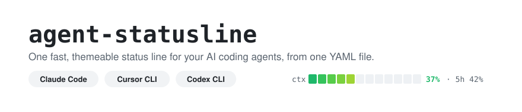
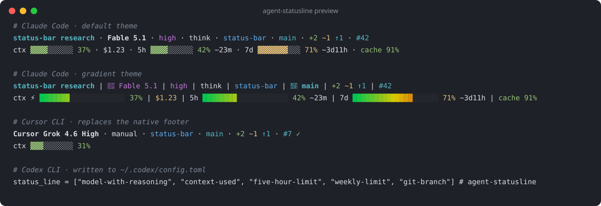
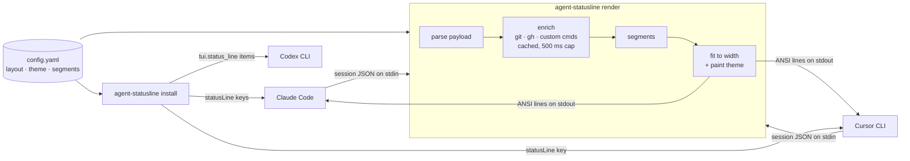

<picture>
  <source media="(prefers-color-scheme: dark)" srcset=".github/assets/banner-dark.svg">
  
</picture>

<picture>
  
</picture>

[](https://github.com/joshi008/agent-statusline/actions/workflows/ci.yml)
[](LICENSE)


[](https://github.com/joshi008/agent-statusline/releases/latest)

[v0.1.0](https://github.com/joshi008/agent-statusline/releases/tag/v0.1.0) · maintained by [@joshi008](https://github.com/joshi008) · **pre-1.0**: config keys and segment ids may change before v1.

## Contents

- [What it does](#what-it-does) shows how it plugs into each tool, and what it deliberately leaves out.
- [Install](#install) covers Homebrew, `go install` and release archives.
- [Quick start](#quick-start) renders a preview and checks your machine, with no tool touched.
- [Choosing a setup](#choosing-a-setup) says which command fits what you want.
- [Usage](#usage) walks through installing, customising, adding your own segments and removing it.
- [Reference](#reference) lists every tool integration, command, segment and rendering rule.
- [Before you rely on it](#before-you-rely-on-it) lists the limitations to know before wiring it into your daily tools.
- [Project](#project) covers versioning, tests, contributing, security and license.

## What it does

`agent-statusline` is one Go binary that owns the status line of three coding agents. Claude Code and Cursor CLI run it as a command and pipe session JSON to it. Codex CLI has no command hook, so the binary instead writes Codex's own list of built-in footer items.



- **`render`** turns a Claude Code or Cursor payload into one or more coloured lines. It never exits non-zero and never prints nothing.
- **`install`** and **`uninstall`** edit each tool's settings surgically. They back every file up first, and uninstall restores exactly what you had.
- **`init`** and **`config edit`** are an interactive wizard with a live preview. **`preview`** and **`themes`** render against sample sessions, so you can iterate without a live agent.
- **`doctor`** checks the wiring, the config, the Codex item ids, render speed and terminal support.

### What it does not do

- It does not patch or wrap the Codex binary. Codex gets only the items Codex itself ships, in your order, with Codex's own colours.
- It makes no network calls while rendering, apart from a cached `gh pr view` for Cursor's PR segment.
- It shows no cost or rate limits for Cursor, because Cursor's payload has neither.
- It runs no daemon. Each render is one short-lived process.
- It is not tested on Windows. It builds there, but macOS and Linux are the supported platforms.

## Install

**Homebrew** (macOS and Linux):

```sh
brew install joshi008/tap/agent-statusline
```

If Homebrew stops with "Your Command Line Tools are too outdated", update them first. Run `softwareupdate --list` and install the Command Line Tools entry it shows, or run `sudo rm -rf /Library/Developer/CommandLineTools && sudo xcode-select --install`. Then run the install again.

**Go** (1.25 or newer):

```sh
go install github.com/joshi008/agent-statusline/cmd/agent-statusline@latest
```

**Release archive:** download the archive for your platform from [Releases](https://github.com/joshi008/agent-statusline/releases/latest), check it against `checksums.txt`, and put `agent-statusline` on your `PATH`. On macOS, a binary downloaded through a browser needs `xattr -d com.apple.quarantine agent-statusline` before its first run.

Upgrade with `brew upgrade agent-statusline`, or run `go install ...@latest` again. The tools keep working after an upgrade, because install records the stable `PATH` location rather than a versioned folder.

## Quick start

Render the bundled sample Claude Code session. Nothing on your machine is changed:

```sh
agent-statusline preview --no-color
```

```text
status-bar research · Fable 5.1 · high · think · status-bar · main · +2 ~1 ↑1 · #42
ctx ▓▓▓▓░░░░░░ 37% · $1.23 · 5h ▓▓▓▓░░░░░░ 42% ~23m · 7d ▓▓▓▓▓▓▓░░░ 71% ~3d11h · cache 91%
```

Then check what it would do on your machine. `doctor` only reads:

```sh
agent-statusline doctor
```

```text
✓ binary  /opt/homebrew/bin/agent-statusline
✓ config  no file at ~/.config/agent-statusline/config.yaml; using defaults
! claude  statusLine runs "bash ~/.claude/statusline-command.sh", not agent-statusline (run `agent-statusline install claude`)
! cursor  no statusLine in ~/.cursor/cli-config.json (run `agent-statusline install cursor`)
! codex   no tui.status_line in ~/.codex/config.toml (run `agent-statusline install codex`)
✓ speed   render takes 0.13 ms
✓ colour  truecolor
```

## Choosing a setup

| You want | Run | Changes files? |
|---|---|---|
| to see it before committing | `agent-statusline preview` / `themes` | No |
| a guided setup with a live preview | `agent-statusline init` | Yes, after you confirm |
| the defaults in every detected tool | `agent-statusline install` | Yes, backed up first |
| just one tool | `agent-statusline install claude` (or `cursor`, `codex`) | Yes, backed up first |
| to change the layout later | `agent-statusline config edit` or edit the YAML | Only the config |
| it gone | `agent-statusline uninstall` | Yes, restores your previous lines |

## Usage

### Install into your tools

When: you want Claude Code, Cursor and Codex to use it.

```sh
agent-statusline init      # guided, with a live preview
# or
agent-statusline install   # defaults, into every detected tool
```

Install writes the absolute path of the binary into each tool's settings. It prefers the `PATH` entry, for example `/opt/homebrew/bin/agent-statusline`, so a `brew upgrade` keeps working. Claude Code picks up the change on its next refresh; restart Cursor and Codex.

Remember: install warns whenever it replaces a status line of yours, and `uninstall` puts that line back.

### Customise the layout

When: you want different segments, a different order, or more lines.

```sh
agent-statusline config init-file     # commented default at ~/.config/agent-statusline/config.yaml
$EDITOR "$(agent-statusline config path)"
agent-statusline preview --width 80   # see how it fits a narrow terminal
agent-statusline config validate
```

```yaml
theme: gradient
claude:
  lines:
    - [session, model, effort, dir, branch, git_status, pr]
    - [context, cost, limit_5h, limit_7d]
cursor:
  lines:
    - [model, autorun, dir, branch, pr]
    - [context]
codex:
  items: [model, effort, context, limit_5h, limit_7d, branch]
```

Remember: a typo in a key fails `config validate`, but while rendering it is only a warning and the rest of your file still applies.

### Add your own segment

When: you want something the built-ins don't show, such as your Kubernetes context.

```yaml
custom:
  - { id: k8s, run: "kubectl config current-context", ttl: 60s }
  - { id: env, text: "prod" }
claude:
  lines:
    - [model, dir, branch, cmd:k8s, text:env]
```

Remember: the command runs through `sh`, and its output is cached for `ttl`. It is killed after 500 ms, together with anything it spawned, so a slow command blanks only its own segment.

### Remove it

When: you want your previous status lines back.

```sh
agent-statusline uninstall            # or: uninstall claude | cursor | codex
```

- It only removes entries agent-statusline wrote. For each key it removes (`statusLine`, `subagentStatusLine`, Codex's `status_line`), it restores the value you had before, in place.
- Every other key is untouched. Backups sit next to each file as `<file>.agent-statusline.bak.<timestamp>`.

## Reference

### Tools

| Tool | Where it writes | What renders |
|---|---|---|
| Claude Code | `statusLine` and `subagentStatusLine` in `~/.claude/settings.json` (or `$CLAUDE_CONFIG_DIR`) | Everything: model, effort, context, cost, 5h and 7d limits with reset countdowns, prompt cache, PR, worktree, plus the per-subagent rows. |
| Cursor CLI | `statusLine` in `~/.cursor/cli-config.json` (or `$CURSOR_CONFIG_DIR`) | Model, max mode, autorun, context. Dir, branch and PR are re-rendered from `git` and `gh`, because Cursor hides its own footer. |
| Codex CLI | `[tui].status_line` in `~/.codex/config.toml` (or `$CODEX_HOME`) | Codex's built-in items in your order. The line carries a `# agent-statusline` comment marking it as ours. |

### Commands

| Command | What it does |
|---|---|
| `init` | Interactive first-run setup, then optional install. |
| `install [claude\|cursor\|codex\|all]` | Wire the tools. With no argument, installs into every detected tool. |
| `uninstall [claude\|cursor\|codex\|all]` | Remove ours and restore your previous lines. |
| `preview [--harness claude\|cursor\|codex] [--theme T] [--width N] [--fixture F]` | Render against a sample session. |
| `themes` | Each theme with a one-line preview. |
| `doctor` | Wiring, config, Codex ids, speed and terminal checks. Exits non-zero on a failure. |
| `config path \| show \| validate \| init-file \| edit` | Inspect, check, create or interactively edit the config. |
| `render --harness claude\|cursor\|auto` | What the tools call. Reads the payload on stdin. |
| `render-subagents` | What Claude Code calls for subagent rows. |
| `version` | Version, commit and build date. |

Global flags: `--config <path>`, `--no-color` (the `NO_COLOR` environment variable also works), and `-v` for diagnostics on stderr.

### Segments

| Segment | Shows | Claude | Cursor | Codex item |
|---|---|:-:|:-:|---|
| `session` | Session name or title | ✓ | ✓ | `thread-title` |
| `model` | Model name | ✓ | ✓ | `model` |
| `effort` | Reasoning effort (low…max) | ✓ | ✓ | `reasoning` |
| `thinking` | Extended thinking badge | ✓ | – | – |
| `fast` | Fast mode badge | ✓ | – | `fast-mode` |
| `max_mode` | Cursor Max Mode badge | – | ✓ | – |
| `autorun` | Cursor autorun / manual approvals | – | ✓ | – |
| `dir` | Working directory (trailing components) | ✓ | ✓ | `current-dir` |
| `repo` | Repository owner/name | ✓ | ✓ | `project-name` |
| `branch` | Git branch | ✓ | ✓ | `git-branch` |
| `git_status` | Staged / modified / ahead / behind | ✓ | ✓ | – |
| `worktree` | Git worktree name | ✓ | ✓ | – |
| `pr` | Open PR with review state, clickable where the terminal supports it | ✓ | ✓ | – |
| `agent` | Agent name (`--agent`) | ✓ | – | – |
| `vim` | Vim mode | ✓ | ✓ | – |
| `version` | Tool version | ✓ | ✓ | `codex-version` |
| `context` | Context window used: bar, %, or tokens | ✓ | ✓ | `context-used` |
| `tokens` | Input / output tokens | ✓ | ✓ | `used-tokens` |
| `cache` | Prompt cache warm / hit ratio | ✓ | – | – |
| `cost` | Session cost (USD) | ✓ | – | `estimated-thread-cost` |
| `duration` | Session wall-clock time | ✓ | – | – |
| `lines` | Lines added / removed | ✓ | – | – |
| `limit_5h` | 5-hour rate limit + reset countdown | ✓ | – | `five-hour-limit` |
| `limit_7d` | 7-day rate limit + reset countdown | ✓ | – | `weekly-limit` |
| `spend` | Spend limit (apps gateway) | ✓ | – | – |
| `time` | Wall clock | ✓ | ✓ | – |
| `cmd:<id>` / `text:<id>` | Your command's output or literal text | ✓ | ✓ | – |

For Codex, `model` directly followed by `effort` becomes `model-with-reasoning`. You may also list raw Codex item ids such as `context-remaining`.

### Rendering rules

- **Never blank.** Empty or garbage input, a broken config, an unknown theme or segment, or a missing `git` still prints a line and exits 0.
- **Absent is not zero.** A field the tool didn't send, such as context before the first reply, drops its segment rather than printing `0%`.
- **Fits the terminal.** When a line is too wide, low-priority segments drop first (`time`, `version` … then `cost`, `context`, `model` last), then the last survivor is truncated. Escape sequences are never cut.
- **Bounded time.** Each external command gets 500 ms, and its whole process group is killed after that. Results are cached per session: git for 5 s, repo for 5 min, PR for 60 s, custom commands for their own `ttl`. A failing lookup falls back to its last cached value.
- **Colour follows the terminal.** Truecolor when `COLORTERM` says so, otherwise 256 or 16 colours. `NO_COLOR` turns colour off.

### Themes

Themes are YAML data:

- `default` is the classic dim-dot look.
- `gradient` has a truecolor gradient bar, emoji and icons.
- `powerline` needs a Nerd Font.

Define your own under `themes:` with `extends:` and override colours, separator, bar glyphs, bar width or icons.

## Before you rely on it

These matter before you wire it into tools you use all day. Each is pinned by a test, and the test names are given so you can check.

### Your settings files

- **Only its own keys change.** Install and uninstall touch only `statusLine`, `subagentStatusLine` and Codex's `status_line`. Every other byte of the file is preserved. Pinned by `TestInstallClaude_ReplacesInPlaceAndWarns` and `TestCodex_PreservesComments`.
- **Your own line comes back.** Uninstall restores what you had, per key and in place, even after unrelated edits. Pinned by `TestUninstall_RestoresStatusLineKeepsUnrelatedEdit` and `TestUninstall_CodexRestoresDottedStatusLineInPlace`.
- **A line you set later is left alone.** A status line you set yourself after installing is never overwritten by an old backup. Pinned by `TestUninstall_ForeignStatusLineSurvivesEvenAfterWeOwnedItBefore` and `TestUninstall_DoesNotResurrectAKeyTheUserDeleted`.
- **Backups stay bounded.** At most 7 for Claude and 6 for Cursor and Codex, and the one uninstall needs is never pruned. Pinned by `TestBackup_BoundedWithClaudeSubagentsDisabled`.
- **Ownership is recognised by name (can miss).** An entry counts as ours when its command path contains `agent-statusline`, or when a Codex line carries the `# agent-statusline` comment. If you install a renamed copy of the binary, uninstall will not recognise it.
- **A comment on your own Codex line is lost.** After install then uninstall, the ids come back but a trailing comment you had on that line does not.

### Rendering

- **The first render after a big change may miss the branch.** A cold `git status` can exceed the 500 ms cap. The segment is then skipped once and appears on the next refresh. Pinned by `TestGit_TimeoutKeepsRenderFast`.
- **A slow custom command cannot stall the bar.** Its whole process group is killed. Pinned by `TestExecRunner_TimeoutKillsCompoundCommands`. On Windows only the direct child is killed.
- **Links depend on the terminal.** PR numbers are clickable in iTerm2, WezTerm, kitty, Ghostty and VS Code. Apple Terminal shows plain text; set `segments.pr.link: always` to force links. Pinned by `TestPR_OSC8Links`.

### Codex

- **Item ids are version-specific.** They were verified against Codex 0.153.4 and 0.159.2. Codex may rename them in future, and `doctor` warns when your Codex is newer than the verified version.
- **Codex draws its own footer.** Only the order and choice of items is ours. Codex's own `/statusline` picker can overwrite the line; `doctor` then reports it as not ours.

## Project

### Versioning and compatibility

The project follows semantic versioning from v0.1.0. Before v1, config keys and segment ids may change, and each release's changes are listed in [CHANGELOG.md](CHANGELOG.md). The toolchain floor is Go 1.25.

### Tests

`go test ./...` runs everything offline. Golden files in `internal/engine/testdata/golden` pin the exact rendered output; after an intended change, refresh them with `go test ./internal/engine -run TestGolden -update`. `make bench` checks the render budget. CI runs vet, the race detector and the benchmark on macOS and Linux.

### Releasing

To cut a release, add its entry to [CHANGELOG.md](CHANGELOG.md), then tag and push:

```sh
git tag -a v0.1.1 -m "agent-statusline v0.1.1"
git push origin v0.1.1
```

The tag runs `.github/workflows/release.yml`, which uses goreleaser to:
- build darwin and linux archives for amd64 and arm64, with checksums, into a GitHub Release;
- commit the updated formula to [`joshi008/homebrew-tap`](https://github.com/joshi008/homebrew-tap), using the `HOMEBREW_TAP_GITHUB_TOKEN` secret.

### Contributing, security and license

- Read [CONTRIBUTING.md](CONTRIBUTING.md) to build, test and add a segment or theme. Every change needs a test.
- Report a vulnerability privately through [SECURITY.md](SECURITY.md), not in a public issue.
- The code is MIT-licensed. Copyright 2026 Hrishabh Joshi. See [LICENSE](LICENSE).
